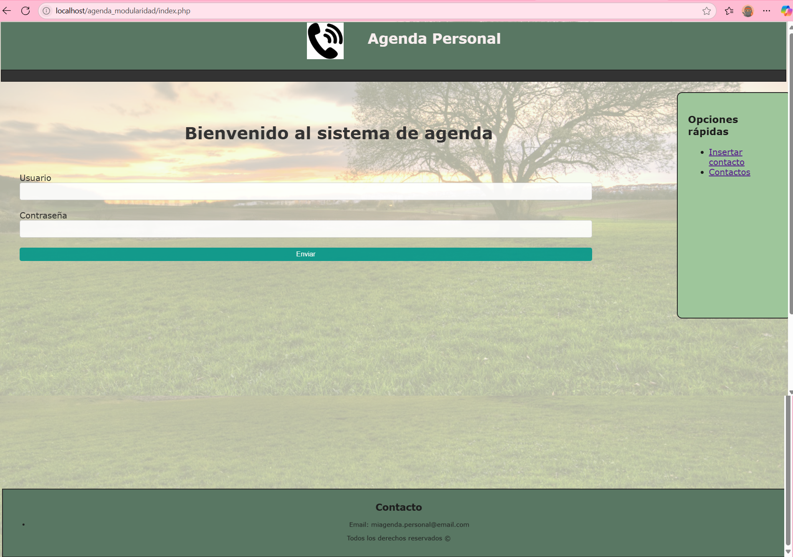
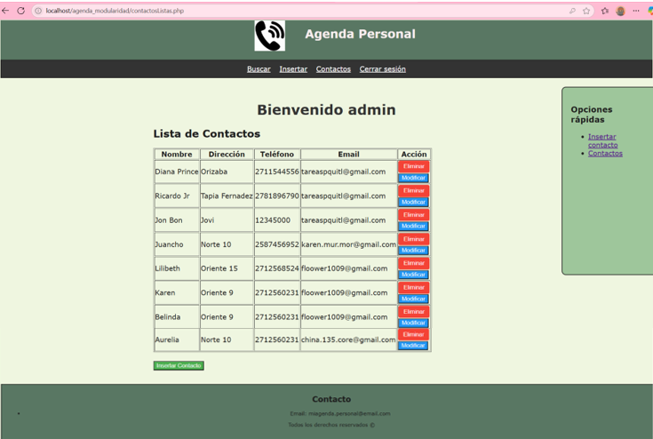
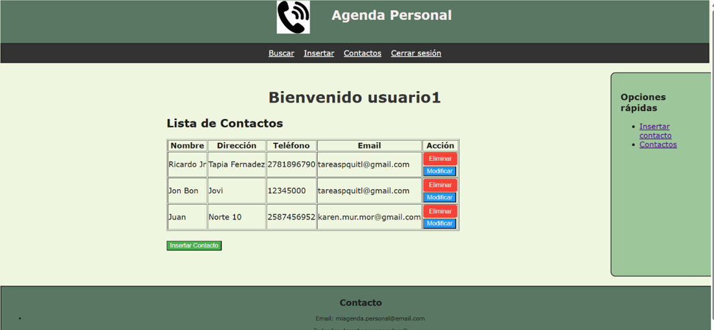

# Proyecto PHP - CRUD "contactos"

## Descripción breve del proyecto

Agenda es una aplicación web desarrollada para gestionar contactos y eventos de manera eficiente, utilizando PHP y MySQL, todo esto usando un CRUD (Crear, leer, modificar y eliminar) en el cual ae administrador podra ver los contactos de los dos usuarios y los usuarios solo podrán ver sus propios contactos.

## Instrucciones de instalación y ejecución

1. Clona o descarga este repositorio en tu servidor local.
   `https://github.com/china153/AgendaPHP.git`
2. Copia la carpeta en el directorio `htdocs` de XAMPP.
3. Crea una base de datos en MySQL llamada `agenda1`.
4. Importa el archivo `contactos.sql` y  `usuario.sql` incluido en el proyecto.
5. Inicia Apache y MySQL desde el panel de control de XAMPP.
6. Accede a la aplicación desde tu navegador en:  
    `http://localhost/agenda_modularidad/index.php`

## Usuarios de acceso

    La aplicación incluye los siguientes usuarios predefinidos para acceder como administrador y usuarios estándar:

    | Usuario    | Contraseña | Rol           |
    |------------|------------|---------------|
    | admin      | 1234       | Administrador |
    | usuario1   | 5678       | Usuario       |
    | usuario2   | 91011      | Usuario       |

    Se puede iniciar sesión con cualquiera de estos usuarios desde la pantalla de acceso.

## Captura de pantalla inicial

    

## Captura de pantalla cuando ingresa el administrador

    

## Captura de pantalla cuando ingresa un usuario

    

## Información de contacto

- **Nombre completo:** Murguía Morales Alma Karen
- **Carrera:** Ingeniería en Sistemas Computacionales
- **Correo electrónico:** karen.mur.mor@gmail.com

